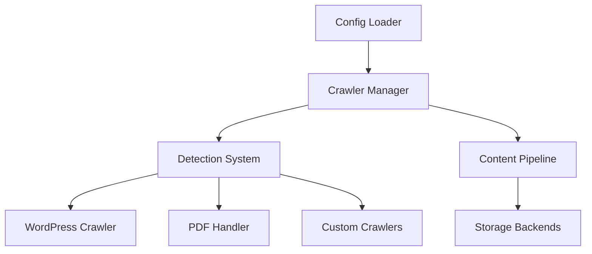

# Architectural Overview

```mermaid
  info
```



## Key components

Core engine:

- Async event loop
- Rate limiting
- Retry logic

Detection flow:

- URL pre-processing
- Header inspection
- Content sniffing
- Fallback to generic

Extension points:

- Crawler registration
- Detection strategies
- Content processors
- Storage adapters
